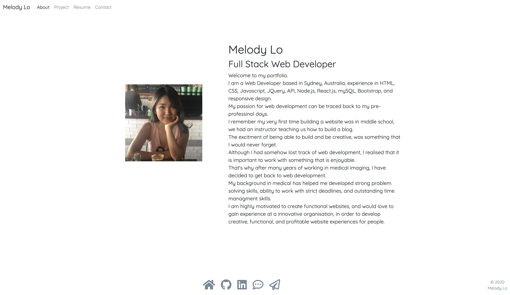

# Portfolio

## Description 

This is Melody's portfolio. I applied knowledge of HTML, CSS, and Javascript that I learned, and created my first responsive portfolio. 
The contents are responsive to various sizes of browser and device.

## Table of Contents (Optional)

* [Installation](#installation)
* [Usage](#usage)
* [Content](#content)
* [Author](#author)

## Installation

There are no installation required. Please simply head to the following link:
https://roukell.github.io/melody_lo_portfolio/

## Usage 

To view portfolio, open the link and it will bring you to the home page. 
You can view contents by scolling down, or click on the buttons in navbar and footer. 

## Content
* About me
* Project
* Resume
* Contact Me (*currently under construction)
* Git Hub
* LinkedIn
* Email Me Directly (by clicking the paper airplane icon)

## Author
Melody Lo
 

